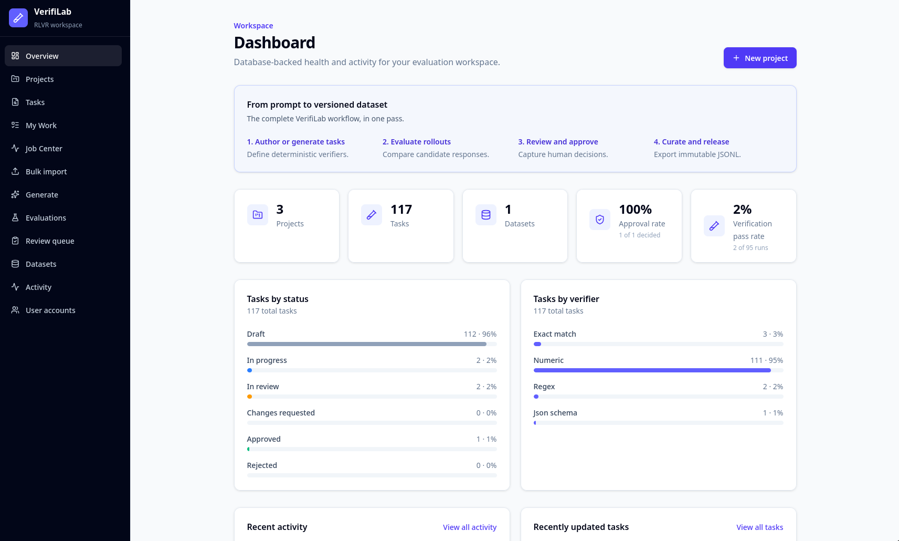

# VerifiLab

VerifiLab is a monolithic Next.js workspace for authoring deterministic evaluation tasks, testing model rollouts, reviewing results, curating datasets, and exporting immutable JSONL releases.



## Core workflow

Create or generate a task → evaluate rollout responses → submit for review → approve → add to a dataset → create an immutable release → export JSONL.

Feature groups include task authoring and imports, four verifier types, rollout evaluations, role-based review, dataset quality findings, immutable releases, background jobs, API tokens, and audit history.

## Docker quick start

```bash
cp .env.example .env
docker compose up --build
docker compose exec app npm run db:seed
```

Open <http://localhost:3000> and sign in with `admin` / `verifilab-demo`. Change `BOOTSTRAP_ADMIN_PASSWORD` before exposing the app. Migrations run automatically when the container starts; the SQLite database persists in the `verifilab-data` volume.

## Local development

Requires Node.js 22 and npm.

```bash
cp .env.example .env
npm ci
npm run db:deploy
npm run db:seed
npm run dev
```

Use `npm run db:migrate` only when developing a new Prisma migration. Existing environments should use `npm run db:deploy`.

## Demo workflow

The seed provides projects, mixed task/verifier statuses, completed and pending rollout evaluations, review comments, verification runs, a dataset/version/release, quality findings, generation and async jobs, and audit events. Follow [the demo script](docs/demo-script.md) for a short evaluation path.

## Testing

```bash
npm run quality       # lint, typecheck, unit/integration tests, production build
npx playwright install chromium
npm run test:e2e      # production-server browser happy path
```

See [testing](docs/testing.md) for isolation details and [deployment](docs/deployment.md) for container operations.

## Implemented architecture

One Next.js 16 App Router process owns the React UI, route handlers, server actions, and background callbacks. Prisma accesses a single SQLite database. The production image uses Next.js standalone output and does not split frontend/backend services. See [architecture](docs/architecture.md).

## Known limitations

- SQLite and in-process background work target demos and small single-instance deployments, not horizontal scaling.
- Rerunning the demo seed resets the seeded admin password to `BOOTSTRAP_ADMIN_PASSWORD` and replaces project demo data.
- No external queue, object store, HA database, or distributed locking is implemented.
- Playwright installs its browser separately and is not part of the fast `quality` command.
