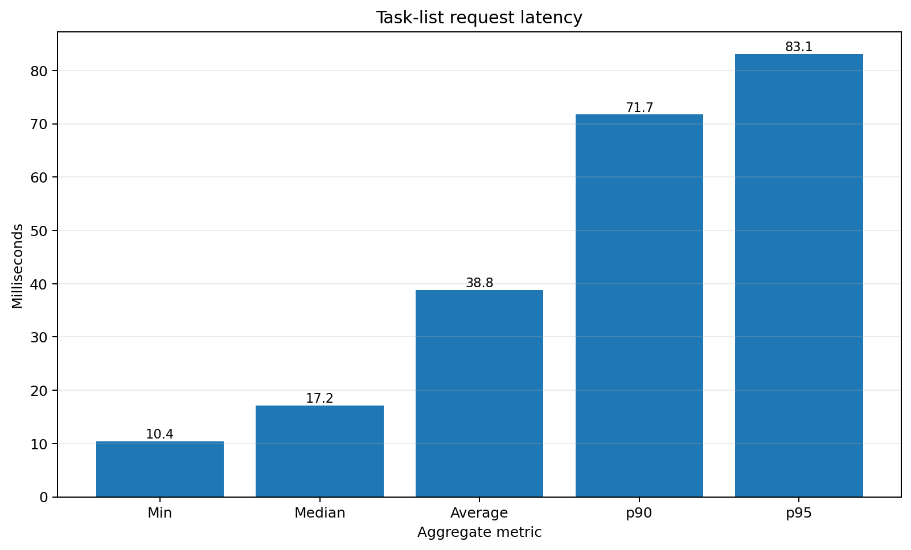
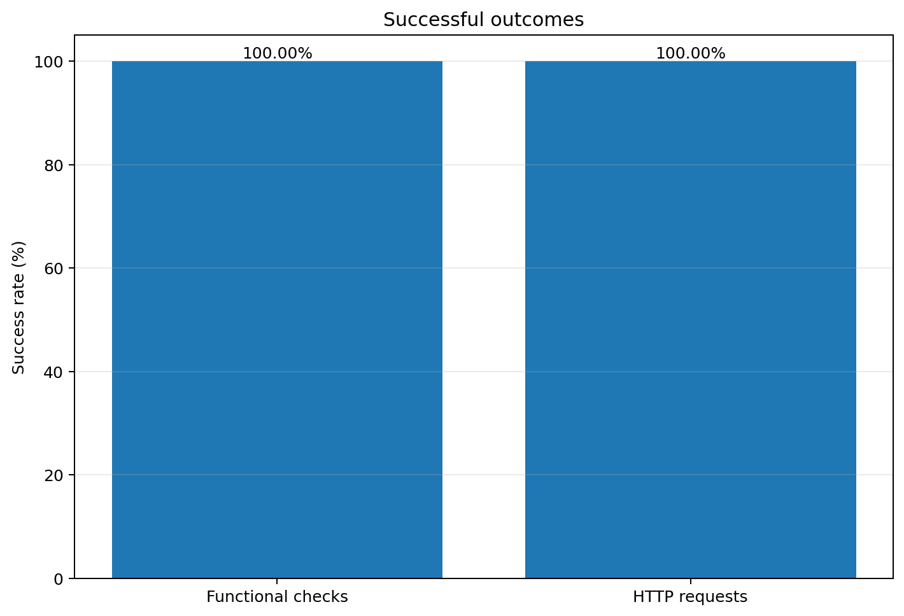

# VerifiLab Task-List Load Test Baseline

**Run ID:** `mruhhf9u-5g2v8z`  
**Scenario:** Task-list read workload  
**Result source:** `baseline-tasks.json`  
**Observed duration:** approximately 60.3 seconds  
**Maximum active virtual users:** 4

## Executive summary

The local task-list baseline completed **1,000 iterations** and **1,002 HTTP requests** with up to **4 concurrent virtual users**.

The workload sustained **16.63 requests per second** with:

- **0% HTTP request failures**
- **100.00% successful functional checks**
- **17.18 ms median latency**
- **83.13 ms p95 latency**
- **2592.91 ms maximum observed latency**

All configured acceptance thresholds were satisfied by the observed metric values:

| Threshold | Required | Observed | Result |
|---|---:|---:|---|
| HTTP error rate | < 1% | 0.00% | Pass |
| p95 request latency | < 750 ms | 83.13 ms | Pass |
| Functional check success | > 99% | 100.00% | Pass |

## Key metrics

| Metric | Value |
|---|---:|
| HTTP requests | 1,002 |
| Successful requests | 1,002 |
| Request throughput | 16.63 req/s |
| Iterations | 1,000 |
| Iteration throughput | 16.59 iterations/s |
| Active VUs | 4 |
| Maximum VUs | 4 |
| Average latency | 38.81 ms |
| Median latency | 17.18 ms |
| p90 latency | 71.74 ms |
| p95 latency | 83.13 ms |
| Maximum latency | 2592.91 ms |
| Functional checks | 1,000 passed / 0 failed |
| Data received | 33.33 MiB |
| Data sent | 176.27 KiB |

## Interpretation

This run confirms that the task-list load-test scenario is operational and that the tested read endpoint remained stable under the configured small concurrent workload.

The observed **p95 latency of 83.13 ms** is well below the configured **750 ms** limit, and no HTTP or functional failures were recorded. This provides a useful regression baseline for comparing future application changes.

The **2592.91 ms maximum latency** is a notable outlier compared with the median and p95 values. A repeated run against a production build should determine whether it came from application warm-up, local Docker scheduling, database contention, garbage collection, or another transient factor.

## What this result proves

- The k6 task-list scenario executes successfully.
- API authentication and preflight checks were sufficient for the run.
- All 1,000 functional checks returned task data.
- The tested endpoint handled the configured local load without recorded failures.
- The result can be used as a performance-regression reference.

## What this result does not prove

This run is **not** evidence that VerifiLab supports 1,000 concurrent contributors or production high-load traffic.

The result was collected with only 4 concurrent virtual users, for approximately 60.3 seconds, against one read-oriented workflow. It does not cover:

- task creation contention;
- batch verification;
- imports or exports;
- asynchronous jobs;
- mixed contributor workflows;
- production network latency;
- production database behavior;
- horizontal scaling;
- sustained soak testing.

## Recommended next measurements

1. Repeat the baseline against `npm run build && npm start`, not the development server.
2. Run the same task-list workload at 10, 25, 50, and 100 VUs.
3. Record p50, p95, p99, throughput, error rate, CPU, memory, and database utilization.
4. Run write and mixed workloads separately.
5. Compare every future run against this baseline:
   - p95: **83.13 ms**
   - throughput: **16.63 req/s**
   - error rate: **0.00%**
   - check success: **100.00%**

## Charts

### Representative request latency

The chart excludes the maximum latency so that the normal request distribution remains legible. The maximum observed latency was **2592.91 ms**.

### Successful outcomes

## Data limitation

The exported k6 summary contains aggregate metrics only. It does not include request-by-request timestamps, so a latency-over-time chart cannot be reconstructed from this file. Future runs can export granular samples to JSON or stream metrics to a time-series backend when temporal charts are required.
